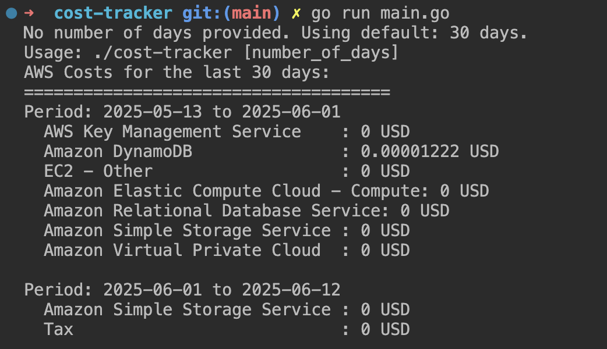

# AWS Cost Tracker

A Go-based tool to track and analyze AWS costs.

## Setup

1. Ensure you have Go 1.21+ installed
2. Configure AWS credentials (via AWS CLI, environment variables, or IAM role(IAM user with Cost Explorer permissions))
3. Install dependencies:
```bash
    go mod tidy
```

## Required AWS Permissions

**Note**: Make sure your aws IAM identity has the following permissions:
```json
    {
    "Version": "2012-10-17",
    "Statement": [
        {
        "Effect": "Allow",
        "Action": [
            "ce:GetCostAndUsage",
            "ce:ListCostCategoryDefinitions"
        ],
        "Resource": "*"
        }
    ]
    }
```

## Usage

```bash
    go build -o cost-tracker
    ./cost-tracker
```

## Desired output



## Further Enhancements or TODOS

- [/] CLI Library (Cobra/Flag): For any serious CLI, **github.com/spf13/cobra** or the standard library **flag** package is almost a must. They handle argument parsing, flags, subcommands, help messages, etc., much more robustly.
- [/] Structured Logging: Instead of log.Printf and log.Fatalf, consider a structured logger like **zap** or **logrus** for better observability in production.
- [] Configuration Management: For more complex settings (e.g., AWS region, different metrics/granularities, output formats), use a configuration library (**viper** is popular) or environment variables.
- [/] Testing: Implement unit tests for NewCostTracker and GetCostsByService by mocking the costexplorer.Client.
- [] Monetary Formatting: For displaying currency, converting the Amount string to a numerical type (like float64 or decimal.Decimal from shopspring/decimal) and then formatting it correctly is best practice.
- [] Error Handling Strategy: For production systems, you might have a more sophisticated error handling strategy (e.g., custom error types, centralized error logging).

## Next Steps

- [ ] Add command line argument parsing (cobra CLI)
- [ ] Add filtering by date range
- [ ] Add cost threshold alerts
- [ ] Export to JSON/CSV
- [/] Add Slack notifications
- [ ] Containerize for Kubernetes deployment