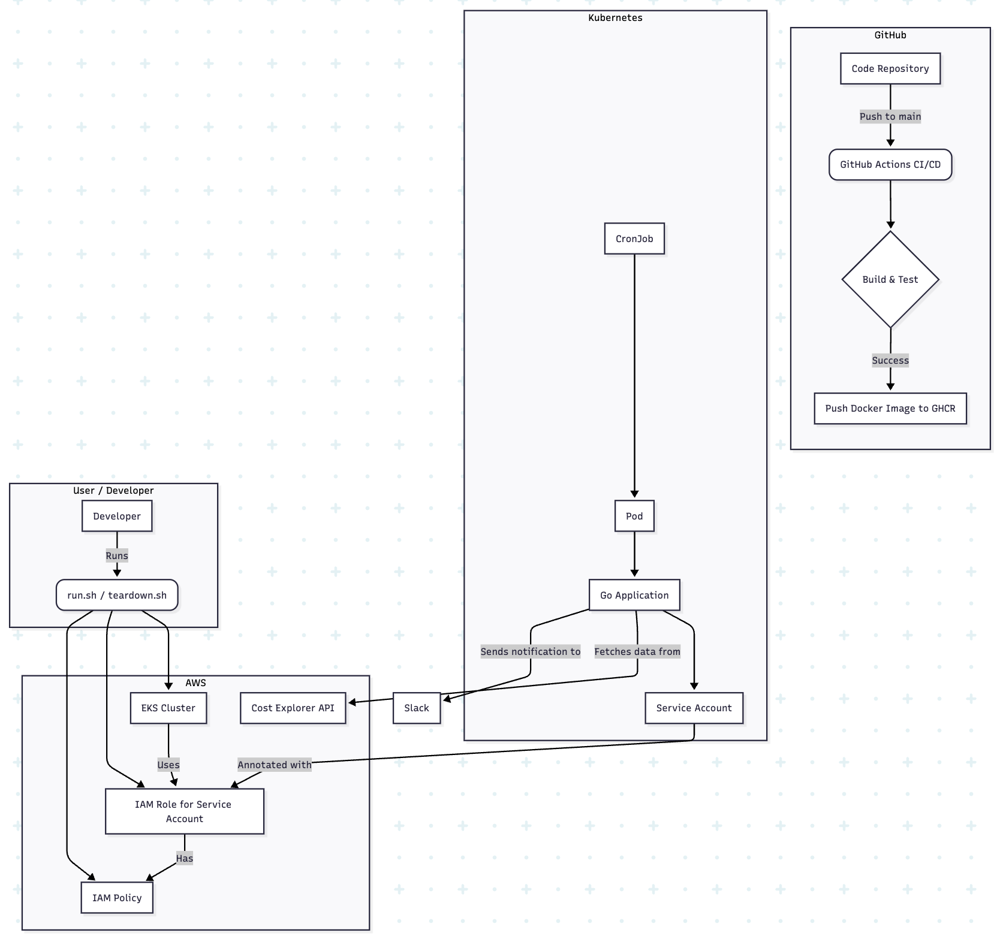

# AWS Cost Tracker

A Go-based CLI tool to track and analyze AWS costs, with support for Slack notifications and Kubernetes deployment.

## About The Project

This project provides a command-line interface (CLI) tool built with Go to fetch and display AWS cost and usage data from the last N days, grouped by service. It's designed to be run manually or as a scheduled job in a Kubernetes cluster.

### Key Features

* **Cost Reporting**: Fetches and displays AWS costs, grouped by service, for a configurable number of days.
* **Configuration**: Flexible configuration using a file, environment variables, or command-line flags.
* **Slack Notifications**: Sends notifications to a Slack webhook URL on success or failure.
* **Kubernetes Ready**: Includes Kubernetes manifests for deploying the application as a CronJob.
* **CI/CD**: A GitHub Actions workflow automates building, testing, and pushing a Docker image.
* **Infrastructure as Code**: Shell scripts are provided to automate the setup and teardown of the necessary AWS and Kubernetes infrastructure.

## Architecture

The AWS Cost Tracker is composed of a few key components that work together:

1.  **Go CLI Application**: The core of the project is a Go application that uses the AWS SDK to interact with the AWS Cost Explorer API. It uses Cobra for command-line parsing and Viper for configuration management.
2.  **Docker**: The Go application is containerized using Docker, allowing it to be run in a consistent environment. The CI/CD pipeline builds and pushes a Docker image to the GitHub Container Registry.
3.  **Kubernetes**: The application is designed to run as a `CronJob` in a Kubernetes cluster. This allows for scheduled, automated cost reporting.
4.  **AWS Integration**:
    * **Cost Explorer**: The application uses the `ce:GetCostAndUsage` and `ce:ListCostCategoryDefinitions` permissions to fetch cost data.
    * **IAM Roles for Service Accounts (IRSA)**: The application uses IRSA to securely grant the necessary AWS permissions to the pod running in the EKS cluster. The `run.sh` script automates the creation of the required IAM role and policy.
5.  **CI/CD Pipeline**: A GitHub Actions workflow is configured to automatically build and test the Go application on every push to the `main` branch. On a successful build and test, it pushes the Docker image to GHCR.

### Visual Representation



## Getting Started

### Prerequisites

* Go 1.22 or higher
* AWS CLI
* `eksctl`
* `kubectl`
* Docker

### Setup and Deployment

The included `run.sh` script automates the setup of all necessary resources.

```bash
./run.sh
```

This script will:

1.  Create an EKS cluster (if it doesn't already exist).
2.  Create the required IAM policy and role.
3.  Deploy the Kubernetes resources (ConfigMap, ServiceAccount, CronJob, and SealedSecret).

### Local Usage

You can also run the application locally:

1.  **Configure AWS Credentials**: Make sure your AWS credentials are set up correctly (e.g., by running `aws configure`).

2.  **Install Dependencies**:

    ```bash
    go mod tidy
    ```

3.  **Build and Run**:

    ```bash
    go build -o cost-tracker
    ./cost-tracker get --days 7
    ```

## Configuration

The application can be configured in the following ways (in order of precedence):

1.  **Command-line flags**: e.g., `--days 7`
2.  **Environment variables**: e.g., `COSTTRACKER_DAYS=7`
3.  **Config file**: `cost-tracker-config.json` in the current directory.
4.  **Defaults**: A default of 30 days is used if no other configuration is provided.

### Example `cost-tracker-config.json`

```json
{
  "days": 15,
  "slack": {
    "webhook_url": "[https://hooks.slack.com/services/your/webhook/url](https://hooks.slack.com/services/your/webhook/url)"
  }
}
```

## Teardown

To remove all the resources created by the `run.sh` script, use the `teardown.sh` script:

```bash
./teardown.sh
```

## TODOs and Future Enhancements

  - [ ] Add cost threshold alerts
  - [ ] Export to JSON/CSV
  - [ ] Containerize for Kubernetes deployment (this is partially done, but could be improved with a Helm chart)